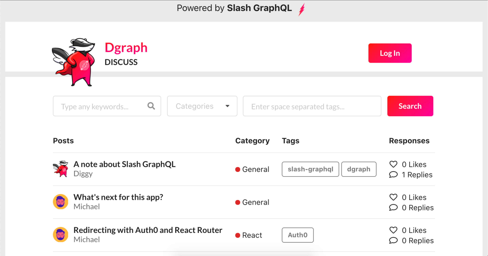

Deployment status : [](https://app.netlify.com/sites/slash-graphql-discuss/deploys)

Message board app (discuss clone) powered by Slash GraphQL

This app is was built as part of a tutorial on building apps with Slash GraphQL




# How it was built

There's a [blog about starting to build](https://dgraph.io/blog/post/slash-graphql-app-setup/) this app.

And a tutorial on the way (see also https://dgraph.io/docs/)

# Running 

Following the tutorial, you can build your own app using Slash GraphQL.  This repo contains the code that's deployed with Netlify at https://slash-graphql-discuss.netlify.app/.  You can use that version of the app like a production build - you can view posts without signing up, or sign up and add your own posts and comments. 

If you want to run this app with your own GraphQL backend, then you need to deploy Slash GraphQL backends as per the tutorial.

If you just want to take this code for a spin, then there's two GraphQL instances used for building this app

* a development instance at https://discuss-dev.us-west-2.aws.cloud.dgraph.io/graphql, and
* a production instance at https://dgraph-discuss.us-west-2.aws.cloud.dgraph.io/graphql (this is the instance behind https://slash-graphql-discuss.netlify.app/).

The `.env.development` and `.env.production` files give the details of the GraphQL backends and Auth0 app.

Running

```
yarn install
yarn start
```

Brings up the React app pointed at the development backend, or swap out with the production server to run locally pointed at the production server.
